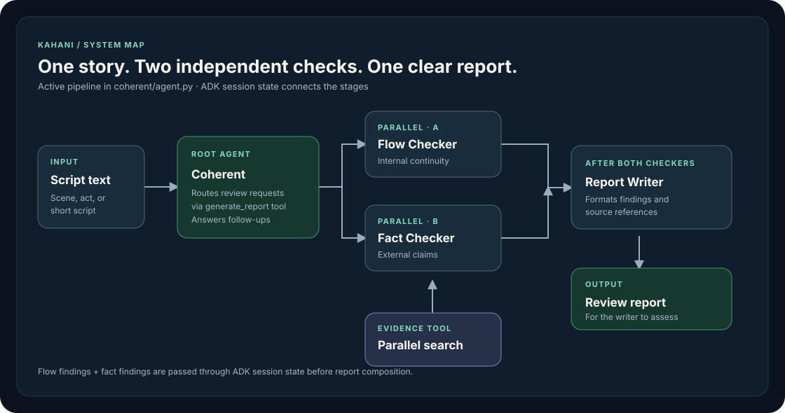
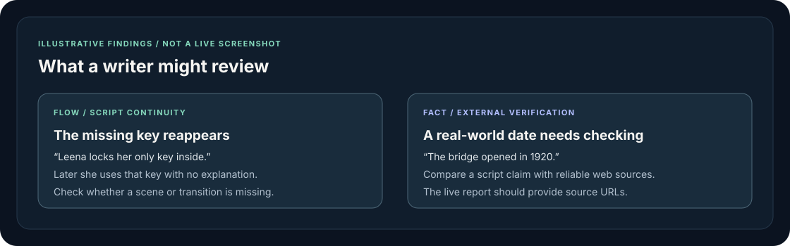

# Kahani

**A story-coherence assistant for scriptwriters.** Kahani helps writers review scenes, acts, and scripts for internal continuity problems and real-world factual errors. Its conversational agent, **Coherent**, turns those checks into a report with script references and, for researched factual claims, source links.

> Local development is available through the Google Agent Development Kit (ADK) web interface. A public deployment is coming soon. The separate `frontend/` page is a prototype, not the recommended way to run the project locally.



## Introduction

Stories can be inventive without being inconsistent. Kahani is an agent for scriptwriters who want to write coherent stories: it looks for contradictions in a story's own rules (such as a character's changing traits or an impossible timeline) and checks real-world claims against web sources. It then organizes potential issues into a report that the writer can review, rather than rewriting the script on the writer's behalf.

The current implementation accepts **plain text** in the ADK chat. You can paste a scene or a shorter script and ask for a review; file upload and durable story-bible tracking are not implemented in this repository.

## Agent architecture

Coherent is the ADK `root_agent` in `coherent/agent.py`. It handles the conversation, decides whether to generate a new review or answer a follow-up question, and has access to a report-generation tool and a fact-search tool. Its report path is:

1. **Orchestrate:** `generate_report` is exposed to Coherent as an ADK `FunctionTool` (held in the Python variable `report_tool_pipeline`).
2. **Check in parallel:** An ADK `ParallelAgent` runs the **Flow Checker** and **Fact Checker** at the same time. The Flow Checker reasons about the script's internal logic without web search. The Fact Checker can call `search_fact`, which queries the Parallel web-search SDK for external evidence.
3. **Share findings:** The checkers store structured findings under `flow_findings` and `fact_findings` in ADK session state.
4. **Write the report:** After both checkers finish, `generate_report` passes their findings to the **Report Writer** through an ADK `AgentTool`. The Report Writer formats factual and logical issues with descriptions and script references; factual issues can include source URLs.
5. **Continue the conversation:** Coherent can answer related follow-up questions without automatically rerunning the entire report pipeline. For factual questions it may search again.

This is **parallel checking followed by sequential reporting**, coordinated by a Python tool function. Although `SequentialAgent` appears in the imports and commented-out code, it is not the active orchestrator. Findings live in the current ADK session state; the planned incremental story bible described in `intention.md` is not yet implemented.



Illustrative example only. The graphic above is not a captured agent response.

## Tech stack

| Component | Role |
| --- | --- |
| Python | Agent and tool implementation |
| [Google ADK](https://google.github.io/adk-docs/) | `Agent`, `ParallelAgent`, `AgentTool`, `FunctionTool`, session state, and the local `adk web` interface |
| [Google Cloud / `gcloud`](https://cloud.google.com/sdk/docs/install) | Cloud project configuration and local Application Default Credentials for model access |
| Gemini | Models configured in `coherent/agent.py` for orchestration, checks, and report writing |
| [Parallel web-search SDK](https://docs.parallel.ai/) | External evidence for factual checks |
| Pydantic and `python-dotenv` | Finding schemas and local environment configuration |
| HTML, CSS, JavaScript | Separate prototype frontend in `frontend/index.html` |

The exact Python packages and pinned versions are in `requirements.txt`. Model access and Google Cloud billing or quotas may apply.

## Installation and local use

### Prerequisites

- Python 3.11 or 3.12, Git, and the [Google Cloud CLI](https://cloud.google.com/sdk/docs/install).
- A Google Cloud project with billing and access to the Gemini model IDs configured in `coherent/agent.py`; enable the Vertex AI API for a standard Vertex AI project. See Google's [ADK quickstart](https://cloud.google.com/vertex-ai/generative-ai/docs/agent-development-kit/quickstart?hl=zh-TW).
- A [Parallel API key](https://docs.parallel.ai/) for the Fact Checker and Coherent's factual search. Keep keys out of version control.

The commands below use macOS/Linux syntax. On Windows, activate the virtual environment with `.venv\Scripts\Activate.ps1` in PowerShell and use `Copy-Item coherent/.env.example coherent/.env` instead of `cp`.

### Set up

```bash
git clone https://github.com/TanishAgrawal/kahani.git
cd kahani

python3 -m venv .venv
source .venv/bin/activate
python -m pip install -r requirements.txt

cp coherent/.env.example coherent/.env
```

Open `coherent/.env` and replace `YOUR_PROJECT_ID` and `YOUR_PARALLEL_API` with your own values. The committed template uses `GOOGLE_GENAI_USE_ENTERPRISE=1` and `GOOGLE_CLOUD_LOCATION=global`, which target Google's enterprise mode. If your project instead uses standard Vertex AI, replace the `GOOGLE_GENAI_USE_ENTERPRISE` line with `GOOGLE_GENAI_USE_VERTEXAI=TRUE` and set `GOOGLE_CLOUD_LOCATION` to a location where your chosen models are available. Google's [Gen AI SDK guidance](https://docs.cloud.google.com/gemini/enterprise/docs/models/sdks/overview) documents both environment configurations. Do not commit `coherent/.env`.

Authenticate locally with [`gcloud` Application Default Credentials](https://cloud.google.com/docs/authentication/set-up-adc-local-dev-environment):

```bash
gcloud auth application-default login
gcloud auth application-default set-quota-project YOUR_PROJECT_ID
```

You may also need to select the project with `gcloud config set project YOUR_PROJECT_ID`, enable the Vertex AI API (`gcloud services enable aiplatform.googleapis.com`), and have permission to use the models. These steps can require billing and IAM access.

### Run in ADK web

From the **repository root** (the parent directory of `coherent/`), run:

```bash
adk web
```

Open the local URL printed by ADK, usually `http://localhost:8000`, and choose **`coherent`** from the agent selector. ADK discovers the package through `coherent/__init__.py` and its `root_agent`. See Google's [ADK quickstart](https://cloud.google.com/vertex-ai/generative-ai/docs/agent-development-kit/quickstart?hl=zh-TW) for the parent-directory launch convention.

Paste a short scene and ask for a report. For example:

```text
Review this scene for factual and continuity errors:

Scene 1: At sunrise, Leena locks her only key inside the house.
Scene 2: Minutes later, without meeting anyone or returning home,
Leena unlocks the front door with that same key.
```

The agent may flag the key continuity issue; actual output depends on the model. To stop the local server, press `Ctrl+C`.

If an agent cannot access a model, check the model IDs in `coherent/agent.py` against the models available to your Google Cloud project and location. If factual searches fail, verify `PARALLEL_API_KEY` in `coherent/.env`. The local ADK interface is the supported demo path today; a hosted release is planned.

## File structure

```text
kahani/
├── README.md                  # Project guide
├── requirements.txt           # Pinned Python dependencies
├── intention.md               # Product vision and planned features
├── assets/
│   ├── architecture.svg       # Agent-flow diagram
│   └── example-findings.svg   # Illustrative report categories
├── coherent/                  # ADK-discoverable agent package
│   ├── __init__.py            # Imports the agent module
│   ├── agent.py               # Coherent, two checkers, report writer, orchestration
│   ├── tools.py               # Parallel-backed fact-search function
│   └── .env.example           # Local configuration template
├── frontend/
│   └── index.html             # Separate UI prototype; not needed for adk web
└── extra/
    └── evals/
        └── Dummy.docx         # Evaluation fixture
```

ADK may generate local session data under `coherent/.adk/`; that folder is not part of the agent source. The current repository includes a session database there, but you do not need to edit it to run the app.

## Status and roadmap

Kahani currently has a local ADK workflow, a fact-search integration, and a standalone frontend prototype. A connected, publicly deployed experience is **coming soon**. The longer-term vision in `intention.md` also includes incremental scene processing, a persistent story bible, and evaluation coverage; these are goals, not features this README claims are finished.
